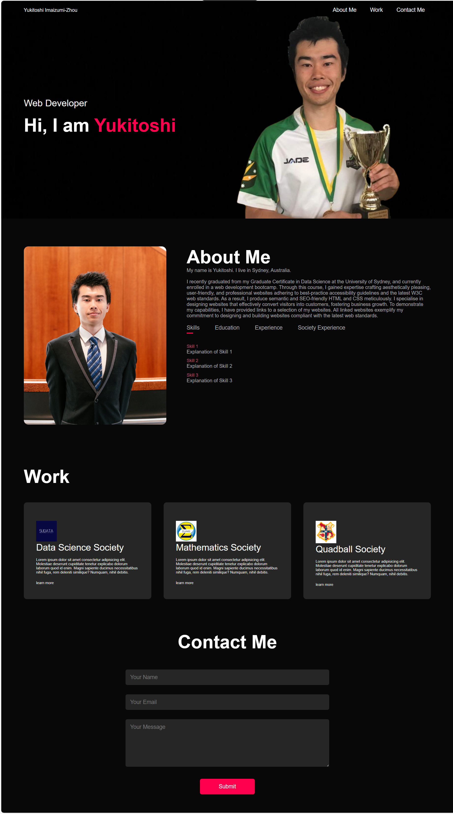
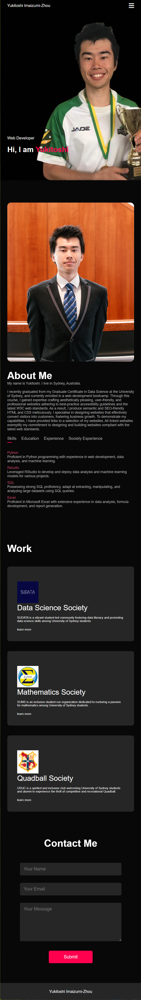
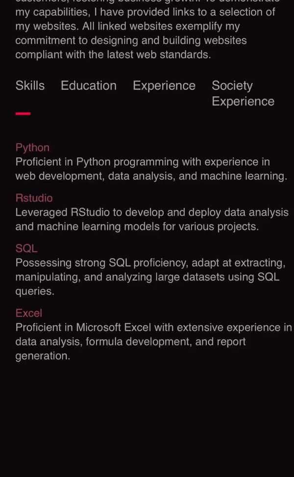

# Yukitoshi-Portfolio
Welcome to Yukitoshi's Portfolio. A meticulously crafted portfolio has been developed, effectively showcasing expertise and accomplishments. This user-friendly platform seamlessly guides potential employers through profile, work, and contact information, fostering a comprehensive understanding of their capabilities.

## Table of Contents

- [Objectives](#objectives)
- [Work](#work)
- [Screenshot](#screenshot)
- [JavaScript](#javascript)
- [Output](#output)
- [Installation](#installation)
- [License](#license)

## Objectives
The following criteria has to be met:

- When loading the employee's portfolio, I should present my name, a recent photo or avatar, and links to sections about them, their work, and how to contact them.
- Clicking on any of the navigation links should scroll the UI to the corresponding section.
- When you click on the link to the section about my work, the UI should scroll to a section with titled images of the developer's applications. 
- The first application presented should have a larger image than the others.
- Clicking on the images of the applications should take you to that deployed application.
- The layout should adapt responsively to my viewport.

## Work
There are 3 projects I have assisted in creating a website, which are Sydney University Data Society (SUDATA), Sydney University Mathematics Society (SUMS), and the University of Sydney Quidditch Society (USQC). As for SUMS, I have created the website using SiteGround. As for USQC, I have created 80% of it using SquareSpace. For SUDATA, I have only helped a bit as I was lacking knowledge in HTML, CSS, Javascript at that time. I will be creating a website for the Sydney University Cyber Security Society which is a new society using HTML, CSS, and Javascript! The criteria of clicking image to my deployed application has met for USQC and SUMS.

## Screenshot
### This is the desktop version:

### This is the mobile version:

## Javascript
### This is the tab links:

### This is the side menu:

## Output
The successfully developed portfolio effectively fulfills the specified criteria and serves as a compelling tool for potential employees to showcase their skills and experience. The user-friendly interface, responsive design, and emphasis on highlighting the developer's work make it an asset in the job application process.

## Installation
The project was uploaded to [GitHub](https://github.com/) at the following repository:
[https://github.com/yukitoshi12345/Yukitoshi-Portfolio](https://github.com/yukitoshi12345/Yukitoshi-Portfolio)

You can access the deployed application with the GitHub Pages link:
[https://yukitoshi12345.github.io/Yukitoshi-Portfolio/](https://yukitoshi12345.github.io/Yukitoshi-Portfolio/)

## License
This project is licensed under the [MIT License](https://github.com/Yukitoshi12345/Yukitoshi-Portfolio/blob/main/LICENSE).

