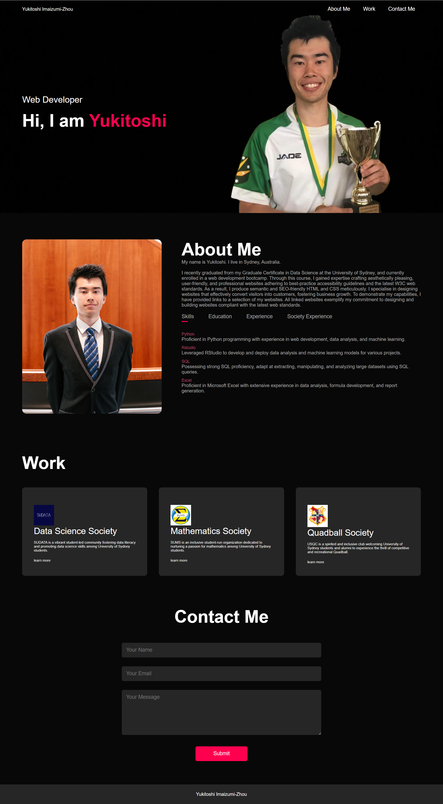
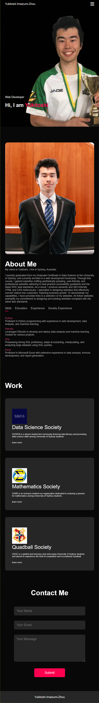
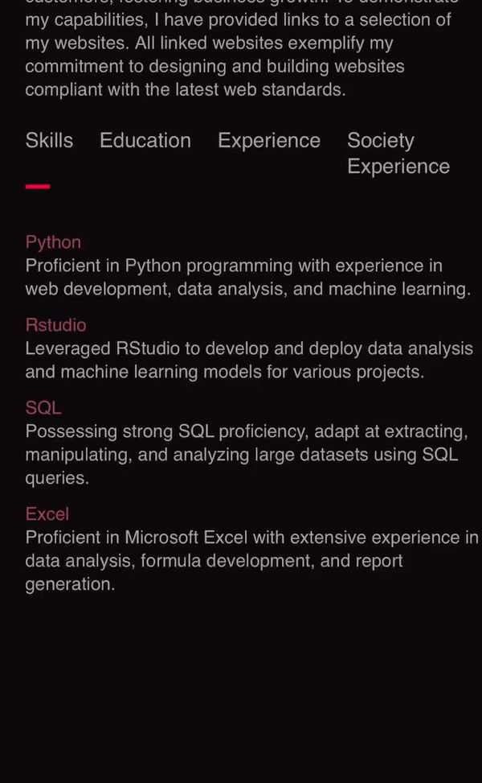

   

<h1 align = "center"> Yukitoshi Portfolio </h1>

Welcome to Yukitoshi's Portfolio. A meticulously crafted portfolio has been developed, effectively showcasing expertise and accomplishments. This user-friendly platform seamlessly guides potential employers through profile, work, and contact information, fostering a comprehensive understanding of capabilities.

## Table of Contents

- [User Story](#user-story)
- [Acceptance Criteria](#acceptance-criteria)
- [Technologies Used](#technologies-used)
- [Screenshot](#screenshot)
- [JavaScript](#javascript)
- [Output](#output)
- [Installation](#installation)
- [Central Grader Comments](#central-grader-comments)
- [License](#license)

## User Story

```
AS AN employer
I WANT to view a potential employee's deployed portfolio of work samples
SO THAT I can review samples of their work and assess whether they're a good candidate for an open position
```

## Acceptance Criteria

Here are the critical requirements necessary to develop a portfolio that satisfies a typical hiring manager’s needs:

```
GIVEN I need to sample a potential employee's previous work
WHEN I load their portfolio
THEN I am presented with the developer's name, a recent photo or avatar, and links to sections about them, their work, and how to contact them
WHEN I click one of the links in the navigation
THEN the UI scrolls to the corresponding section
WHEN I click on the link to the section about their work
THEN the UI scrolls to a section with titled images of the developer's applications
WHEN I am presented with the developer's first application
THEN that application's image should be larger in size than the others
WHEN I click on the images of the applications
THEN I am taken to that deployed application
WHEN I resize the page or view the site on various screens and devices
THEN I am presented with a responsive layout that adapts to my viewport
```

## Technologies Used

- HTML
- CSS
- JavaScript

## Screenshot

### This is the desktop version:



### This is the mobile version:



## Javascript

### This is the tab links:



### This is the side menu:


## Output

The successfully developed portfolio effectively fulfills the specified criteria and serves as a compelling tool for potential employees to showcase their skills and experience. The user-friendly interface, responsive design, and emphasis on highlighting the developer's work make it an asset in the job application process.

## Installation

The project was uploaded to [GitHub](https://github.com/) at the following repository:
[https://github.com/yukitoshi12345/Yukitoshi-Portfolio](https://github.com/yukitoshi12345/Yukitoshi-Portfolio)

You can access the deployed application with the GitHub Pages link:
[https://yukitoshi12345.github.io/Yukitoshi-Portfolio/](https://yukitoshi12345.github.io/Yukitoshi-Portfolio/)

## Central Grader Comments

Grade: 100/100

Hi Yukitoshi, really great work on this assignment! You showed your ability to create a super nice portfolio website using HTML and CSS. Your navigation works well and sends users to the correct location on the page, well done!

Your UI is really nice, I can see that you have good experience in web development based on the layout and design choices. Your application is responsive, it looks great on smaller devices as well as larger ones thanks to your use of flexbox and media queries, very nicely done!

Great job deploying your application, you were able to deploy to a live URL and your application loads with no errors.

You were able to submit your GitHub URL and your repo has a unique name.You made many commits to your repo and your commit messages were good at explaining the changes you made to your code, great job. You were able to comment on your CSS code which is nicely done. Commenting on your code shows graders that you understand your code and makes it easier for you to navigate your code when looking back at it in the future.

Your readme is great, providing a description, screenshot and a link to the deployed application.

I’m very impressed to see you make use of the skills you have learned so far to create this portfolio website. Keep up the brilliant work Yukitoshi!

- RDP, Centralized Grading.

## License

This project is licensed under the [MIT License](https://github.com/Yukitoshi12345/Yukitoshi-Portfolio/blob/main/LICENSE).
